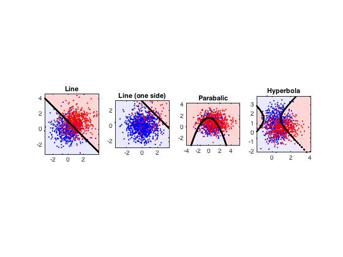
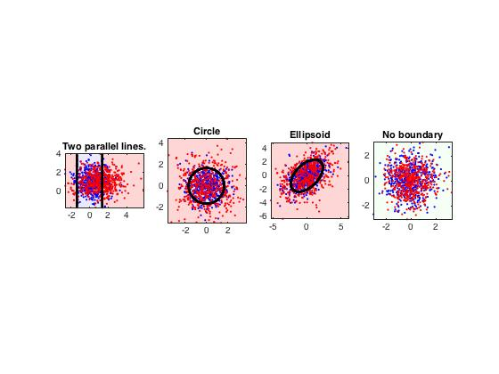
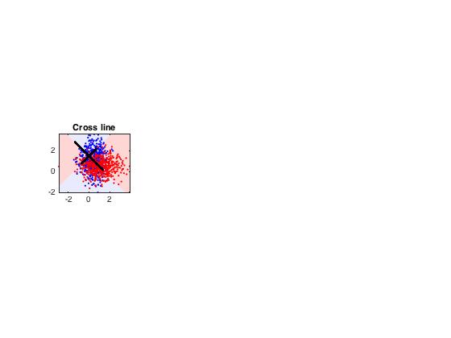

# Data Mining - Assignment 1

黄昭阳	3130000696

[TOC]

## Machine Learning Problems

### Decision Problem

Choose proper word(s) from
​	A) Supervised Learning

​	B) Unsupervised Learning 

​	C) Not Learning

​	D) Classification 

​	E) Regression 

​	F) Clustering 

​	G) Dimensionality Reduction

to describe the following tasks.

1. Automatically group thousands of art paintings by similar artistic styles.

   `BF`

2. Play sudoku1 by searching the whole action space to find the possible solution.

   `C`

3. Recognize handwritten digits by looking for the most similar image in a large datasetof labeled digit images, then use its label as result.

   `AD`

4. Visualize very high dimensional data in 2D or 3D space.

   `G`

5. Based on former patients’ records, predict the success rate of a surgery for a newpatient.

   `AE`

6. Given thousands of peoples’ names and sexes, decide a new person’s name is maleor female.

   `AD`

7. Discover communities of people in a social network.

   `BF`

8. Using historical stock prices, predict stock price in the future.

   `AE`

9. Represent image as a well chosen 64 bits integer, so that similar images will be represented as integers with small hamming distance.

   `BG`

### True of False

Question:

​	True or False: “To fully utilizing available data resource, we should use all the data wehave to train our learning model and choose the parameters that maximize performanceon the whole dataset.” Justify your answer.

Answer: 

​	False

Reason:

​	Apparently, to avoid  overfitting, estimation of our model should be errors in test set instead of errors in data set.

## Bayes Decision Rule

a.Suppose you are given a chance to win bonus grade points:

​	There are three boxes. Only one box contains a special prize that will grantyou 1 bonus points. After you have chosen a box B1 (B1 is kept closed), oneof the two remaining boxes will be opened (called B2) such that it must notcontain the prize (note that there is at least one such box).

​	Now you are are given a second chance to choose boxes. You can either stickto B1 or choose the only left box B3. What is your best choice?

i) 	What is the prior probability of B1 contains prize, P(B1 = 1)?

`p(B1=1) = 1/3`

ii)	What is the likelihood probability of B2 does not contains prize if B1 containsprize, P(B2 = 0|B1 = 1)? 

`p(B2=0 | B1=1) = 1`

iii)	What is the posterior probability of B1 contains prize given B2 does not containprize, P(B1 = 1|B2 = 0)?

` p(B1=1 | B2=0) = p(B1=1,B2=0)/p(B2=0) = 1/3`

iv)	According to the Bayes decision rule, should you change your choice or not?

```
	 p(B1=1) = 1/3 ,

	 p(B3=1) = p(B3=1 | B2=0)p(B2 = 0) + p(B3=1 | B2=1)p(B2=1) = 1/2

			So I'll change my choose that decide B3

```


b.Now let us use bayes decision theorem to make a two-class classifier. Please refer thecodes in the bayes decision rule folder and main skeleton code is run.m. There are twoclasses stored in data.mat. Each class has both training samples and testing samplesof 1-dimensional feature x.

### Maximum likelihood decision

​	Finish the calculation of likelihood of each feature given particular class(in likeli-hood.m). And calculate the number of misclassified test samples(in run.m) usingmaximum likelihood decision rule. Show the distribution of P(x|ωi), and reportthe test error.

#### Calculate likelihood:

$$
p(x=i|w_{j}) = \frac{Num(x=i,w_{j})}{\sum_{k=Min}^{Max}Num(x = k,w_{j})}
$$

```
function l = likelihood(x)
%LIKELIHOOD Different Class Feature Liklihood 
%
%   INPUT:  x, features of different class, C-By-N vector
%           C is the number of classes, N is the number of different feature
%
%   OUTPUT: l,  likelihood of each feature(from smallest feature to biggest feature) given by each class, C-By-N matrix
%

[C, N] = size(x);
l = zeros(C, N);
%TODO
s = repmat(sum(x,2),[1,N]);
l = x./s;

end
```

#### Distribution of P(x|w )

  -Distribution.jpg)

#### Test error:

```
x1 : 

 	3

x2 : 

	61
	
total:
   0.213333333333333
```

### Optimal bayes decision

​	Finish the calculation of posterior of each class given particular feature(in poste-rior.m). And calculate the number of misclassified test samples(in run.m) usingoptimal bayes decision rule. Show the distribution of P(ωi|x), and report the testerror.

#### Calculate posterior

$$
p(w_{j}|x = i) = \frac{p(x=i|w_{j})*p(w_{j})}{p(x = i)}
$$

```
function p = posterior(x)
%POSTERIOR Two Class Posterior Using Bayes Formula
%
%   INPUT:  x, features of different class, C-By-N vector
%           C is the number of classes, N is the number of different feature
%
%   OUTPUT: p,  posterior of each class given by each feature, C-By-N matrix
%

[C, N] = size(x);
l = likelihood(x);
total = sum(sum(x));
%TODO
px = sum(x,1)./total;   %px(1,i) = p(x = i)

prior = sum(x,2)./total;    %prior(i,1) = p(w = j)
p = l.*repmat(prior,[1,N])./repmat(px,[C,1]);
end

```

#### Distribution of P(w|x)

 -Distribution.jpg)

#### Test error:

```
x1 : 
    15

x2 : 
    32
    
total:
   0.156666666666667
```

### Minimize total risk

​	There are two actions {α1,α2} we can take, with their loss matrix below. Showthe minimal total risk (R = ∑ mini R(αi|x)) we can get.

| λ(αi \|ωj ) | j=1  | j=2  |
| ----------- | ---- | ---- |
| i=1         | 0    | 1    |
| i=2         | 2    | 0    |


Likelihood Ratio:
$$
\frac{p(x|w_{1})}{p(x|w_{2})} > \frac{\lambda_{12}-\lambda_{22}}{\lambda_{21}-\lambda_{11}}*\frac{p(w_{2})}{p(w_{1})}
$$

$$
Threshold =  \frac{\lambda_{12}-\lambda_{22}}{\lambda_{21}-\lambda_{11}}*\frac{p(w_{2})}{p(w_{1})}
$$

$$
R = \sum_{x} min_{i}R(\alpha_{i}|x)
$$

$$
R(\alpha_{i}|x) = \sum_{j=1}^{c}\lambda(\alpha_{i}|w_{j})p(w_{j}|x)
$$

```
decision_rate = l(1,:)./l(2,:);
%likelihood ratio decision_rate for each xi

decide_with_risk = sign([decision_rate - threshold]);
decide_with_risk(decide_with_risk<0)=0;  %choose x1 if decide_with_risk(1) == 1
decide_with_risk = [decide_with_risk;1-decide_with_risk];

risk = risk*p;
r = sum(risk.*decide_with_risk).*sum(test_x);
R = sum(r);
disp('R');
disp(R);
```

#### Risk score

```
R
  70.934647550074232
```

## Gaussian Discriminant Analysis and MLE

a.

​	Given a dataset {(x(i), y(i)) | x ∈ R2, y ∈ {0, 1}, i = 1, ..., m} consisting of m samples. We

assume these samples are independently generated by one of two Gaussian distributions:
$$
p(x|y=0) = N(\mu_{0},\Sigma_{0})
$$

$$
p(x|y=1) = N(\mu_{1},\Sigma_{1})
$$

the prior probability of y is
$$
p(y) = \phi^{y}(1-\phi)^{1-y} =
\begin{cases}
   \phi,   & \mbox{y=1} \\
   1-\phi, &\mbox{y=0}
\end{cases}	Sinc	
$$
The code of this section is in the gaussian discriminant folder.

(a)  Given a new data point x = (x1, x2), calculate the posterior probability.What is the decision boundary?

Answer:

​	They are independent identically distribution with different means, so their decision boundary must be a line. After some simple test, we find their decision boundary is x+y=1. It's visuallization is showed below called 'line'.


b.

### Gaussion Possibility

​	An extension of the above model is to classify K classes by fitting a Gaussian distri-

bution for each class, i.e.

​	Then we can assign each data points to the class with the highest posterior probability.Your task is to finish gaussian pos prob.m, that compute the posterior probability ofgiven datasets X under the extended model. See the comments in gaussian pos prob.m for more details.

```
function p = gaussian_pos_prob(X, Mu, Sigma, Phi)
%GAUSSIAN_POS_PROB Posterior probability of GDA.
%   p = GAUSSIAN_POS_PROB(X, Mu, Sigma) compute the posterior probability
%   of given N data points X using Gaussian Discriminant Analysis where the
%   K gaussian distributions are specified by Mu, Sigma and Phi.
%
%   Inputs:
%       'X'     - M-by-N matrix, N data points of dimension M.
%       'Mu'    - M-by-K matrix, mean of K Gaussian distributions.
%       'Sigma' - M-by-M-by-K matrix (yes, a 3D matrix), variance matrix of
%                   K Gaussian distributions.
%       'Phi'   - 1-by-K matrix, prior of K Gaussian distributions.
%
%   Outputs:
%       'p'     - N-by-K matrix, posterior probability of N data points
%                   with in K Gaussian distributions.

N = size(X, 2);
K = length(Phi);
P = zeros(N, K);    

% Your code HERE
D = size(X,1);
sumx = zeros(N,1);

for j=1:1:K
    x = bsxfun(@minus,X,Mu(:,j));
    P(:,j) = 1/((2*pi)^(D/2)*det(Sigma(:,:,j))^(1/2)) * exp(sum(-1/2*x'/Sigma(:,:,j).*x', 2))*Phi(j);
end
sumx = sum(P,2);
p = bsxfun(@rdivide,P,sumx);
```

Detail explanation:
$$
x = X - \mu \\
x^{T}\Sigma^{-1}x
$$


​	We want to use matrix calculations instead of for-loop as matrix calculation in MATLAB is much faster than for-loop, so we have to transform the formula of vectors multiplication to a formula that we can operate it with matrix only. We have K different classes, so a for-loop involves K can't be omitted.
$$
for\ i:1\rightarrow N \\
	x_{i}^{T}\Sigma^{-1} x \\
	\Downarrow \\
X=[x_{1},x_{2},...]\\
X^{T}\Sigma^{-1}.*X
$$
c.

### Geometricall properties about gaussian discriminant function

​	Now let us do some field work – playing with the above 2-class Gaussian discriminantmodel. For each of the following kind of decision boundary, find an appropriate tupleof parameters φ, μ0, μ1, Σ0, Σ1. Turn in the code run.m and the plot of your result inyour homework report.

​	The gaussian discriminant function with logarithm operator is showed below:
$$
g_{i}(x) = -\frac{1}{2}(x-\mu_{i})^{T}\Sigma_{i}^{-1}(x-\mu_{i})-\frac{d}{2}ln2\pi-\frac{1}{2}ln\left|\Sigma_{i}\right|+lnP(w_{i})
$$
​	The decision boundary to separate the dicision space can be measured from this equation:
$$
g_{i}(x)-g_{j}(x) = 0
$$
The quadratic form showed below has some significant properties:
$$
\begin{pmatrix}
x\\y
\end{pmatrix}^{T}
\begin{pmatrix}
a & b\\
c & d
\end{pmatrix}
\begin{pmatrix}
x\\y
\end{pmatrix}
$$

	1. Parameter 'b' and 'c' can't be omitted since they can be seen as rotation elements and the geometrical shape can be constructed by only 'a' and 'd(Using SVD can explain it wonderfully, but here I just proposed this trick and it works)', so to satisfy the geometrical shape requirement, we can only play with the diagonal matrix to construct the covariance matrix

$$
\Sigma = 
\begin{pmatrix}
\frac{1}{a} & 0 \\
0 & \frac{1}{d}
\end{pmatrix}\\
\Sigma^{-1} = 
\begin{pmatrix}
a & 0 \\
0 & d
\end{pmatrix}
$$

2.The decision boundary equation showed above can be expanded like this when the covariance matrix is a diagonal matrix.
$$
(a_{1}-a_{2})x^{2}-2(a_{1}\mu_{x_{1}}-a_{2}\mu_{x_{2}})x+(d_{1}-d_{2})y^{2}-2(d_{1}\mu_{y_{1}}-d_{2}\mu_{y_{2}})y+C+ln(P(w_{1}))-ln(P(w_{2})) = 0
$$
So some interesting tricks can be proposed:
$$
\begin{cases}
a_{1},a_{2}  &  \mbox{Determine the existence of  }x^{2}\\
d_{1},d_{2}  &  \mbox{Determine the existence of  }y^{2}\\
\mu_{x_{1}},\mu_{x_{2}}  &  \mbox{Determine the existence of  }x\\
\mu_{y_{1}},\mu_{y_{2}}  &  \mbox{Determine the existence of  }y\\
P(w_{1}),P(w_{2})  &  \mbox{Determine the existence of constant}\\
\end{cases}
$$
To construct the decision boundary according to the requirement, we can use different parameters under the consideration proposed above.

(i) A linear line.
$$
x+y=1 \\
$$
Requirements:	

​	Make both coefficient of quadratic terms be 0	

​		a1 = a2 = 1

​		d1 = d2 = 1

​	Ensure one coefficient of the linear term be not 0

 (ii) A linear line, while both means are on the same side of the line.


$$
P(w_{1}) = 0.1
$$
Requirements:

​	Use constant(P(w1)) to translate the line that make the means are on the same side of the line.
(iii) A parabolic curve.(iv) A hyperbola curve.(v) Two parallel lines.
$$
a_{1} = 1\\
a_{2} = 0.5
\\d_{1} = d_{2} = 1
$$


Requirements:

​	Make one coefficient of quadratic term not be not 0, and the other one be 0.

(iv)A hyperbola curve.
$$
a_{1} = 2 \\
a_{2} = 1 \\
d_{1} = 1 \\
d_{2} = 2
$$
Requirements:

​	Make both coefficient of quadratic terms not be 0, and they have opposite sign.	

(v) Two parallel lines.
$$
a_{1} = 2 \\
a_{2} = 1 \\
d_{1} = 1 \\
d_{2} = 2\\
\mu_{x_{1}}=0.5\\
\mu_{y_{1}}=1\\
\mu_{x_{2}}=1\\
\mu_{y_{2}}=1
$$
Requirements:

​	Make one coefficient of quadratic term be not 0, and the other coefficient of variables be 0.

​	Make the constant not be 0.

​	We can get equations like x^2 = k to get parallel lines.

(vi) A circle.
$$
a_{1} = 1 \\
a_{2} = 2 \\
d_{1} = 1 \\
d_{2} = 2
$$


Requirements:

​	Make both coefficient of quadratic terms not be 0, and they have same sign.	


(vii) An ellipsoid.
$$
a_{1} = 2 \\
a_{2} = 4 \\
d_{1} = 2\\
d_{2} = 3
$$
Requirements:

​	Under de consideration of circle, we should make the coefficient of quadratic terms be different.

(viii) No boundary, i.e. assigning all samples to only one label.

Requirements:

​	All parameters be equal can result in no boundary.(We get equation C = 0)


I''ve draw an additional diagram respond to the equation (x+sx)^2 = (y+sy)^2 that result in cross line.

### Dicision Boundary Diagrams

 

  

 

​	You can see all the details about the algorithm in the program, and there still exist some tricks that we should avoid negtive number in some cases, etc.

d.

​	Given a dataset {(x(i), y(i)) | y ∈ {0, 1}, i = 1, · · · , m}, what is the maximum likelihoodestimation of φ, μ0 and μ1? (Optionally, you are encouraged to compute the MLE for all the other parameters Σ0, Σ1, and generalize to the K-class gaussian model. This will be challenging but rewarding.)

Answer:

​	Using MLE can't get the estimation of *phi*(it is worked out from the trainning dataset directly), but *μi* and *Σi* can be estimated easily through the formula below:
$$
\phi = n/N\\
--------------------------\\
lnP(x_{k}|\mu) = -\frac{1}{2}ln[2\pi^{d}|\Sigma|] - \frac{1}{2}(x_{k}-\mu)^{T}\Sigma^{-1}\frac{1}{2}(x_{k}-\mu)\\
\nabla lnP(x_{k}|\mu) = \Sigma^{-1}(x_{k}-\mu)\\
MLE:\sum^{n}_{k=1}\Sigma^{-1}(x_{k}-\mu) = 0\\
\hat{\mu}=\frac{1}{n}\sum_{k=1}^{n}x_{k} \\
--------------------------\\
\bar{X} = [x_{1}-\hat{\mu},x_{2}-\hat{\mu},...,x_{n}-\hat{\mu}]\\
\hat{\Sigma} = \frac{1}{n}\bar{X}\bar{X}^{T} - According\ to\ the\ definition
$$

​	

​	My code showed below can get gaussian parameter estimation according to MLE:

```
function [Mu Sigma] = MLE(X)
[K,N] = size(X);
Mu = sum(X,2)/N;
x = bsxfun(@minus,X,Mu);
Sigma = x*x'/N;
```

​	The description as above just finished the task that work out the estimation of parameter, but our goal is to classify instances into k classes. There are two solutions I find to solve K-class classification problem below.

Solution 1:

​	To generalize the 2-class model to K-class model, we can use ECOC strategy. I've finished the task to estimate all the parameters for the given dataset( You can see more detail in the code), but the generization was not implemented because I have no data to judge my program even if I've implemented it. The crucial step can be  described as below:

Train:

	1.Specify a unique binary code for each class,so the length L of the code will be at least log2(k) .
	2.Generate a binary classifier for each bit.
	2. We get a bit-string S of length L after travelling the L classifiers. For each class Ci we have an unique Si to be the representation.

Test:

​	For each input case x, we can get its corresponding descriptor Xi, and we'll classify it as the class j whose representation Sj has the closest hamming distance to the descriptor Xi.


Result Sample:

```
Sample1:
Original Phi:
   0.400000000000000

Original Distribution of X0:
Mu:
   0.500000000000000   1.000000000000000

Sigma:
   0.500000000000000                   0
                   0   1.000000000000000

Original Distribution of X1:
Mu:
   1.000000000000000   0.500000000000000

Sigma:
   1.000000000000000                   0
                   0   0.500000000000000

Estimated Phi:
   0.400000000000000

Estimated Distribution of X0:
Mu:
   0.518369914611905
   1.045187442842205

Sigma:
   0.491162470805049   0.001974844584765
   0.001974844584765   1.055274833710113

Estimated Distribution of X1:
Mu:
   1.048238351672657
   0.552532284650419

Sigma:
   1.049423407152530  -0.013937009432454
  -0.013937009432454   0.532191217691622


Sample2:
Original Phi:
   0.100000000000000

Original Distribution of X0:
Mu:
     0
     0

Sigma:
     1     0
     0     1

Original Distribution of X1:
Mu:
     1
     1

Sigma:
     1     0
     0     1

Estimated Phi:
   0.100000000000000

Estimated Distribution of X0:
Mu:
  -0.016689019619030
   0.032705565738020

Sigma:
   0.959448689227751  -0.030871461062195
  -0.030871461062195   1.075700263402306

Estimated Distribution of X1:
Mu:
   1.028369886694545
   1.095595067692529

Sigma:
   0.959142311331371   0.013905877687748
   0.013905877687748   0.956255047323195  
```

Solution 2:

​	Use Gaussian Mixed Model to classify K-class. Use trainning dataset of class I to generate its gaussian parameters according to the formula mentioned above. Then we choose the class T who owns the maximum possibility as its classification.

## Text Classification with Naive Bayes

​	In this problem, you will implement a text classifier using Naive Bayes method, i.e., aclassifier that takes an incoming email message and classifies it as positive (spam) or neg-ative (not-spam/ham). The data are in hw1 data.zip. Since MATLAB is not good at text processing and lacks of some useful data structure, TA has written some Python scriptsto tranform email texts to numbers that MATLAB can read from. The skeleton code isrun.m(in text classification folder).

​	In this assignment, instead of following TA’s Python scripts and run.m, you can use anyprogramming language you like to build up a text classifier barely from email texts. You aremore encouraged to finish the assignment in this way, since you will get better understandingof where the features come from, what is the relationship between label, emails and words,and other details.

a.

​	It is usually useful to visualize you learnt model to gain more insight. List the top 10

words that are most indicative of the SPAM class by finding the words with highest

ratio P (wordi|SPAM)/P(wordi|HAM) in the vocabulary.

### Top10 words:

```
 30033       75526       38176       45153        9494   
 65398       37568       13613       56930		 9453
```

Corresponding words:

```
nbsp viagra pills cialis voip php meds computron sex ooking
```


Analysis:

1)

### Posterior formula transformation:

​	After abandonning the constant parameter p(x) and combining the formula with this problem, we can get the formula below.
$$
p(w_{j}|x) = \prod_{i=1}^{N}p(x_{i}|w_{j})^{x_{i}}p(w_{j}) \\
ln(p(w_{j}|x)) = \sum_{i=1}^{N}x_{i}ln(p(x_{i}|w_{j}))+ln(p(w_{j}))
$$


​	It can avoid floating underflow problem, and we can get the result from matrix multiplication directly.

​	In matlab, it is like this:

```
pxw = test*log(l)';  %Q-by-C vector, pxw(i,j) - log(p(xi|wj))
pwx = bsxfun(@plus,pxw',log(pw));
                        % C-by-Q vectpr, pwx(i,j) - log(p(wi|xj))
                        % in this case, w1-out of class, w2-in class
```


2)

### Likelihood calculation:

​	It is a little different compared to the bayesian model I've learnt from lectures and books that collectting all the SPAM and HAM emails to count the overall words frequency. We can get the likelihood as the formula below:
$$
p(x_{i}|w_{j})=\frac{Num(x_{i},w_{j})}{\sum_{k=1}^{N}Num(x_{k},w_{j})}
$$
​	In matlab, it is like this:

```
l = bsxfun(@rdivide,x,sum(x,2));
```

Tricks:

​	In fact, I consider this problem as below firstly:
$$
p(SPAM|x_{i}) = \frac{Num(SPAM,x_{i})}{Num(SPAM,x_{i})+Num(HAM,x_{i})}
$$
​	This is an intuitive formula that we get the possibility that classify an email as SPAM depending on wordi independently, so we get the posterior directly. Then we can transfer it to likelihood through the bayesian formula below.
$$
p(x|w)=\frac{p(w|x)*p(x)}{p(w)}
$$
​	In matlab, it is like this:

```
posterior = bsxfun(@rdivide,x,sum(x));  % xij/xi - p(wj|xi)
l = bsxfun(@rdivide,posterior,pw); % in fact we omit multiply p(xi) as it is a constant
```


​	I've provided both of the solutions metioned above in my code and comment the second solution as it is obviously not the bayes way and I've not found a coresponding algorithm to decribe it.

b.

### Accuracy

​	What is the accuracy of your spam filter on the testing set?

Answer:

```
Accuracy of spam filter:
   0.985731559854897
```

$$
Accuracy = \frac{TP+TN}{TP+TN+FP+FN}
$$


c.

​	True or False: a model with 99% accuracy is always a good model. Why? (Hint:consider the situation of spam filter when the ratio of spam and ham email is 1:99).

Answer:

​	False.

Reason:

​	Under the consideration of the hint, suppose the ratio of spam and ham email is 1:99 and we classify all the emails as ham email, we can get the accuracy of this model is 99%. As you can see, this model make no sense, so False.


d.

​	With following confusion matrix3:

|               | Spam(label) | Ham(label) |
| ------------- | ----------- | ---------- |
| Spam(predict) | TP          | FP         |
| Ham(predict)  | FN          | TN         |

compute the precision and recall of your learnt model, where precision = tp/(tp+fp), recall

= tp/(tp+fn)

### Precision and Recall

```
Precision of model:
   0.975022301516503

Recall of model:
   0.972419928825623
```


e.

​	For a spam filter, which one do you think is more important, precision or recall? Whatabout a classifier to identify drugs and bombs at airport? Justify your answer.

Answer:

​	For a spam filter, precision is more important, because a ham is classified as spam and is threw into the rubbish bin may cause significant information be ignored but it just make user to delete it that a spam is classified as ham.

​	For drugs and bombs, recall is more important, because it must result in tremendous damage if missing a bomb but FP cases just make staff have one more check.


## Conclusion

1.This assignment makes me be familiar with Naive Bayesian Classifier and MLE and have a nice experience of implementation.

2.According to considering the questions of 1.b. & 4.e, I've developed some sense to trade off the significance of estimation parameters with specific applications.

3.It makes me have a start step in matlab.

4.Mathematicl skills was improved.

5.Comprehension about quadratic forms was improved.

## References

1.Slides provided in this class